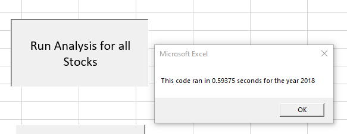

# Stock-analysis

## Overview of Project
Steve would like to have a workbook that illustrates how DQ has done in the stock market. In this project, it was also important to include other Green Energy stocks, similar to DQ.
### Purpose
To provide Steve and his parents with information regarding the stock market for Green Energy, specifically looking at DQ, as well as other Green Energy stocks such as AY, CSIQ, ENPH, FSLR, HASI,JKS, RUN, SEDG, SPWR, TERP, VSLR

## Analysis and Challenges
### 2017 Stock Return Rates Analysis
 
Using VBA, and code I had already created with the guidance of the module that required me to look at formatting return rates for postive and negative rates, determining the law row, determining a starting and ending price, adding tickers to pull specific stocks, and modififying code to return specific years, I modified it to work faster. I had also set up a pop up that asks which year I want to review. The modifications included usign additional variables for each ticker. This include ticker volumes, ticker starting prices, and ticker ending prices. Then I re-used old code but modified it to include tickers. I had to set the initial tickers at 0 for the 12 tickers I reviewed.

  
To put it in perspective, the data initally took 0.5859375 seconds. With the revision, it dropped to 0.1171875 seconds for 2017. This saved a bit of time, possibly not noticable to the average user, but the coding would allow faster review, less memory being used by the program, and just more efficiency in code.

Comparing 2017 and all of green energy stocks mentioned in the purpose, the majority of stocks has a postive return rate with the exception of TERP at -7.2%.
Looking specifically as DQ, there was a return rate 199.4% which is quite high. Looking at the volume of stocks for DQ there is about 35 million stocks in the daily volume. The majority of other stocks, including those with high percentages, have in the hundreds of millions of stocks in daily volume. The only other stock in the tens of millions is HASI and their percentage is significantly less. Interestingly, the highed volume is for SPWR with a rate of 23.1%. This will prove important later.

### 2018 Stock Return Rates Analysis

I used the same formatting and programing as mentioned above. The difference was solely that it was pulling 2018 instead of 2017. Following the instructions of the module, before modifying the code to run more effectively, I had also modified to allow to review any year. Initially I had set it up just for 2018. However, once I mad ehte revisions above, I was able to run the code.

  
When I ran the code initially for 2018, it took 0.59375 seconds. After the upgrades mentioned above, it took 0.1171875 seconds. This also saved time and memory in this macro. Ultimately I kept the old code on a seperate module to ensure I could review in the future and compare the improvements I make.

As for the data, in 2018 most stocks saw a negative return rate for the year, including DQ. Comparing from 2017,  DQ is now in the hundreds of millions in terms of daily volume. Similarly  HASI, a stock that was also in the tens of millions, is also in the hundreds of millions now. It was significantly closer to the hundreds of millions that DQ was in 2017, but now DQ is high in daily volume. However, DQ is seeing a 62.6% rate of return. DQ is the highest negative return rate of all the stocks reviewed. Previously, I had reviewed SPQR, one the highest volume stocks in 2017. Now we see less volume, and see a fairly negative rate of return. There are two stocks performing well and these are ENPH and RUN. 

### Challenges and Difficulties Encountered
I had several challenges in writing my code as syntax is incredibly important. The biggest issue was knowing information such as, adding 12 to the new ticker based variables. It was also adding (tickerIndex) after each of these variables when determing the volume, starting, ending price. It did help that I had code already to achieve these results, and I was able to modify it. I kept receiving errors for not ending the for loops, or end if, and I also had issues understanding where I was in the code so I did have to go back and indent so that it would make sense for me.

## Results
What are the advantages or disadvantages of refactoring code?
Some advantages, as mentioned above, is that it saved time. It took less time to run the code that before I had made improvements to the code adding ticker volume, starting, and ending prices. It also takes less memory as macro. It was definitely more difficult to do in terms of the syntax. There is room for error on the programmers part. 

How do these pros and cons apply to refactoring the original VBA script?
Since the revised code including ticker starting prices, ending prices, and volume, the code was more automatic. It didn't have to read through as much of the data and was more steamlined to look for each of the tickers and determine each price and volume. As a novice in this, the cons were that I was trouble shooting more because of my syntax. Adding the 12, setting the variables to zero, and adding the extra (tickerIndex) after each of the variables was time consuming to figure out. It did however, make good practice. As I continue to learn more skills regarding data, I would like to see how VBA would compare to other ways of reviewing data.